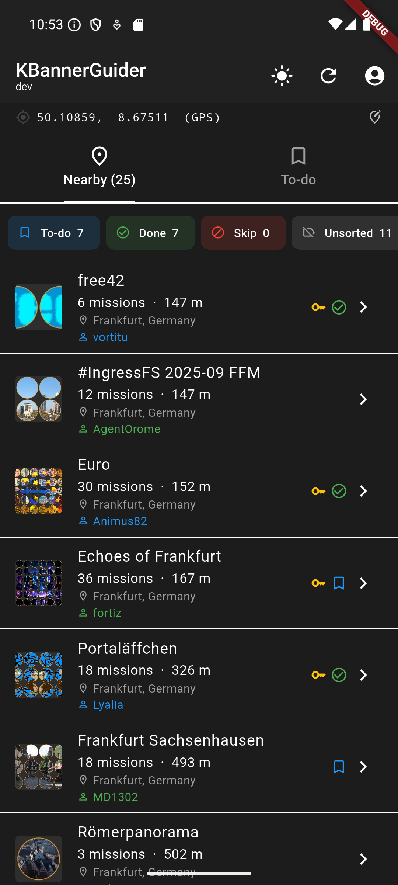
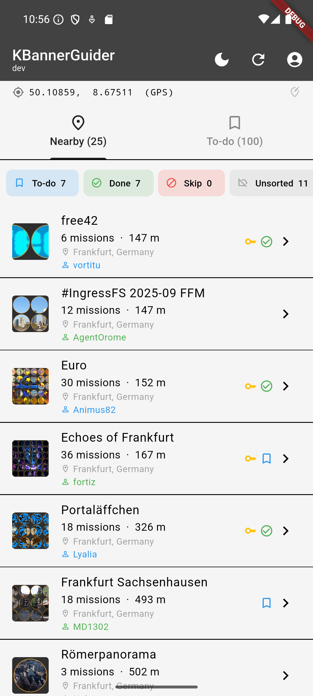
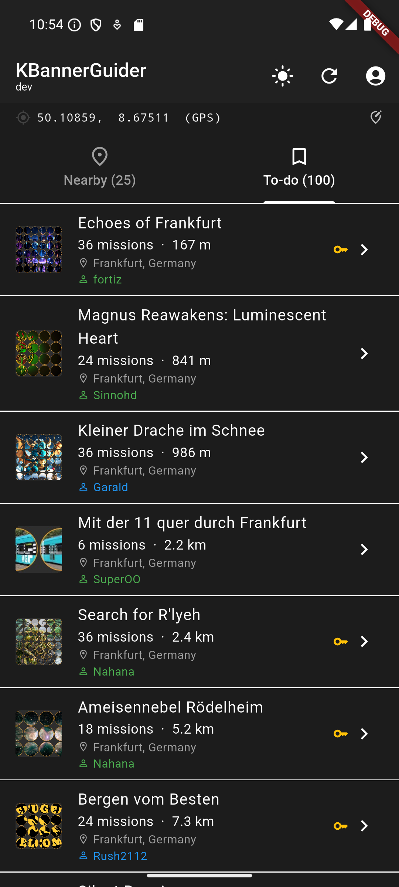
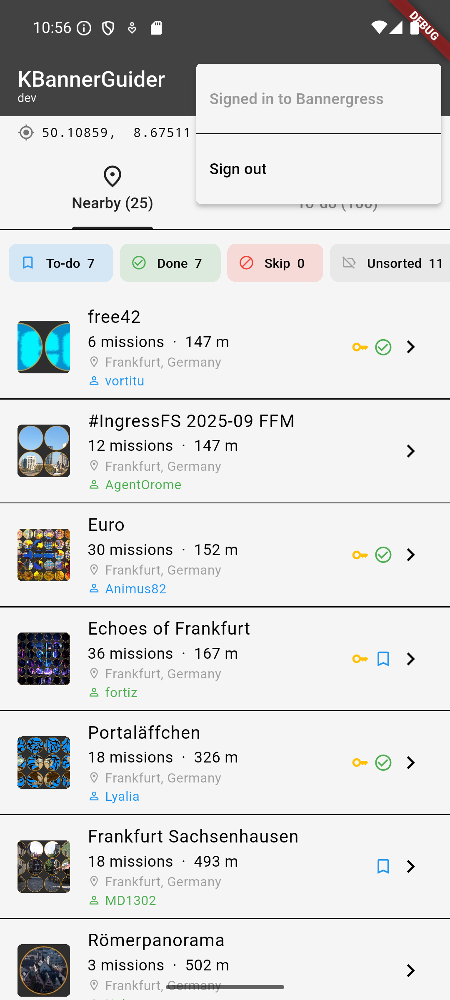
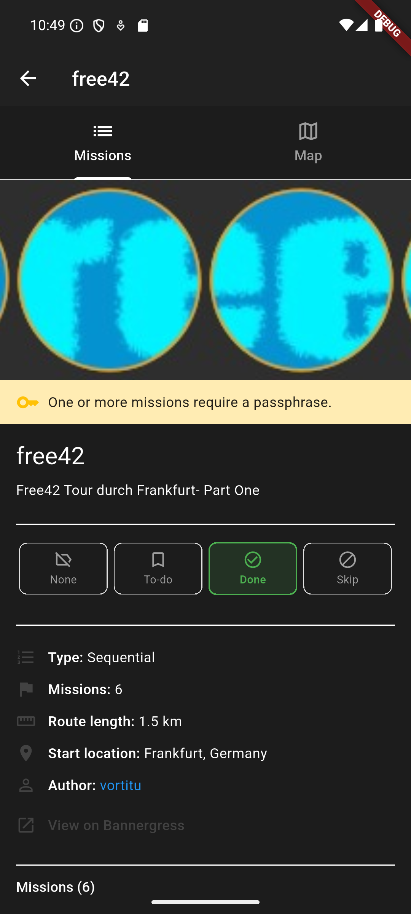
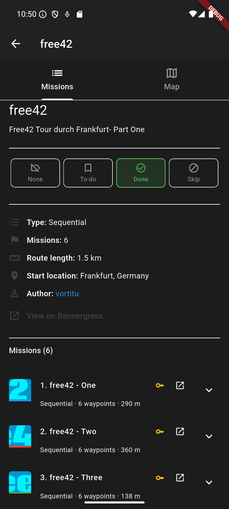
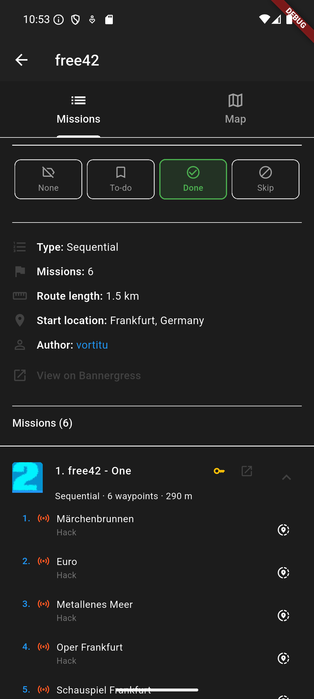
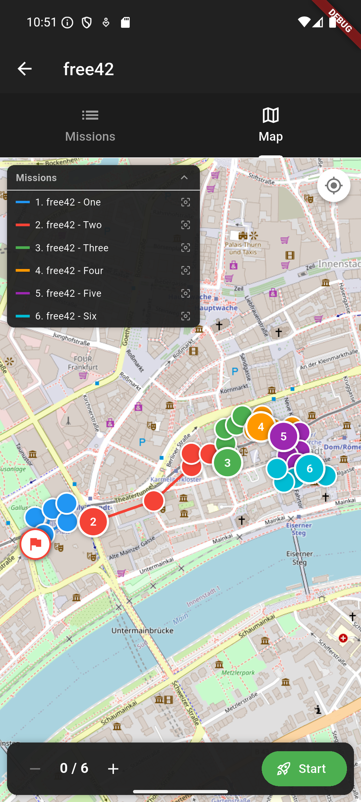
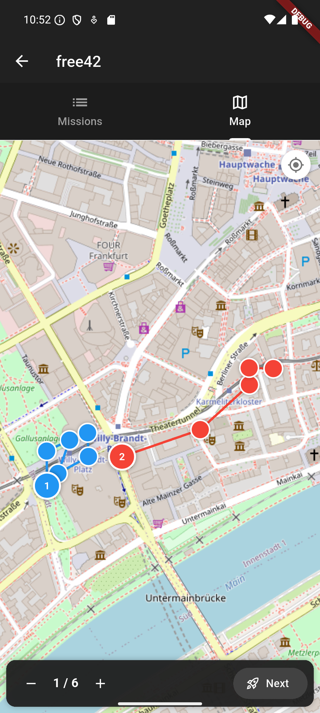
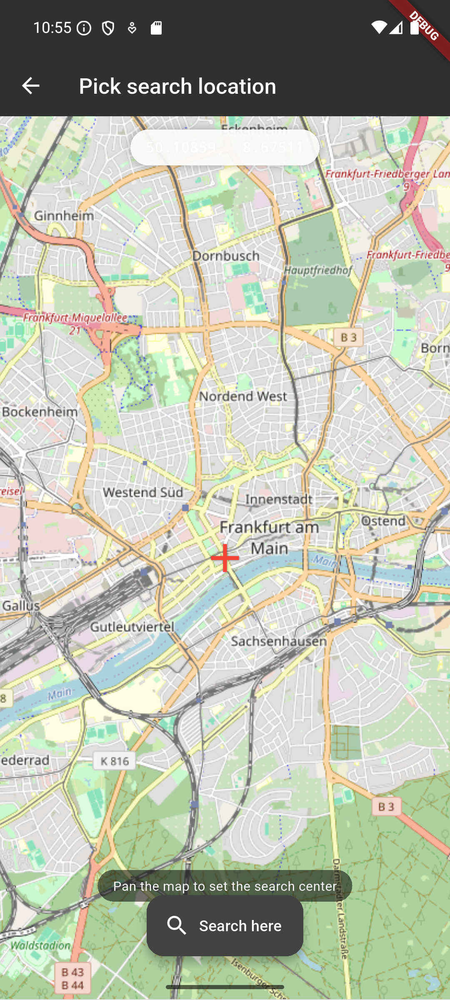

# User Guide

## Overview

kBannerGuider connects to the [Bannergress](https://bannergress.com/) API to show Ingress mosaic banners near you. Sign-in is optional — browsing works without an account. List management (To-do / Done / Skip) requires a Bannergress account.

---

## Banner List Page

The home screen opens immediately and starts fetching banners near your GPS location.

### App Bar

| Control | Action |
|---|---|
| ☀️ / 🌙 icon | Toggle between light and dark theme (persisted across restarts) |
| ↺ Refresh | Re-fetch the current tab's data |
| 👤 Account | Sign in / Sign out of Bannergress |

### Location Bar

The bar below the app bar shows your current search center.

- **GPS mode** — shows your device's latitude/longitude followed by `(GPS)`. Tap to open the [Location Picker](#location-picker).
- **Custom mode** — shows the manually chosen coordinates in orange. A GPS icon on the right clears the custom location and reverts to GPS.

Tapping the bar always opens the [Location Picker](#location-picker) to set a new search center.

### Nearby Tab

Lists the 25 nearest banners, sorted by proximity to the search center. Scroll to the bottom to load the next 25 (infinite scroll).

Each **banner tile** shows:
- Thumbnail image (tap to view full-screen)
- Title
- Mission count and distance
- Start address
- Author name with faction color (Enlightened = green, Resistance = blue) — visible when signed in
- Warning indicator (⚠️ amber) if the banner has an active warning
- Passphrase indicator (🔑 amber) if any mission requires a passphrase
- List type badge (bookmark = To-do, ✓ = Done, ⊘ = Skip) — visible when signed in

Tap any tile to open the [Banner Detail Page](#banner-detail-page).

#### Filter Bar (signed in only)

When signed in and banners are loaded, a filter bar appears with four chip filters:

| Chip | Shows |
|---|---|
| 🔖 To-do N | Banners in your To-do list |
| ✓ Done N | Banners marked Done |
| ⊘ Skip N | Banners in your blacklist |
| — Unsorted N | Banners with no list assignment |

Tap a chip to hide/show that category. The count on each chip reflects the current Nearby results.

#### Sign-in Banner (signed out only)

A blue card prompts you to sign in and unlocks list management features. If sign-in fails, the card turns red and shows the error.

### To-do Tab

Shows all banners in your Bannergress To-do list, sorted by distance from your current GPS position.

Pull down to refresh. The tab label shows the count, e.g. `To-do (100)`.

When signed out, the tab shows a prompt with a sign-in button.

### Account Menu

Tap the account icon (👤 when signed out, solid circle when signed in) to access:
- **Sign in** — opens the Bannergress login WebView
- **Signed in to Bannergress** (label, non-clickable)
- **Sign out** — clears all stored tokens and resets list state

---

## Banner Detail Page

Tap any banner tile to open its detail page. The page immediately shows list data from the tile and loads full mission data in the background (spinner in the app bar title row while loading).

### Missions Tab

The Missions tab shows, from top to bottom:

1. **Banner image** — full-width thumbnail. Tap to open a full-screen zoomable viewer (pinch to zoom, tap anywhere to close).
2. **Warning banner** (if present) — amber strip with the Bannergress warning message.
3. **Passphrase notice** (if applicable) — amber strip indicating one or more missions require a passphrase entry.
4. **Title and description**
5. **List Type Selector** (signed in only) — four buttons: None / To-do / Done / Skip. The active selection is highlighted. Tapping a button posts the change to Bannergress immediately.
6. **Info rows** — Type, Missions count, Route length, Start location/coordinates, Author (with faction color), Event dates, Planned offline date.
7. **"View on Bannergress"** link — opens the banner's Bannergress page in an external browser.
8. **Mission list** — each mission is an expandable tile.

#### Mission Tile

Each tile shows:
- Mission thumbnail with a color-coded stripe at the bottom
- Mission number and title
- Passphrase indicator if needed
- "Open in Ingress" button — launches the mission directly in the Ingress app (or Intel map as fallback)
- Subtitle: type (Sequential / Any order), waypoint count, route length

Tap a tile to expand it and see individual waypoints:

Each waypoint step shows:
- Step number (in mission color)
- Objective icon and type:
  - 📡 Hack
  - 🏳 Capture / Upgrade
  - 🔗 Create Link
  - △ Create Field
  - 🔧 Install Mod
  - 📷 Take Photo
  - 👁 View Waypoint
  - 🔑 Enter Passphrase
- POI name (or "(hidden waypoint)" for hidden steps)
- Share location button — opens the waypoint in any geo-aware app (Maps, OsmAnd, etc.)

### Map Tab

The Map tab renders all mission routes on an OpenStreetMap base map.

**Map elements:**
- **Numbered start markers** — colored circle with the mission number, positioned at the first waypoint of each mission
- **Waypoint dots** — smaller colored circles for subsequent waypoints
- **Polylines** — colored route lines connecting waypoints within each mission
- **Flag marker** — red-bordered circle with 🏁 icon at the banner's official start point; tapping opens a sheet to open the location in a navigation app
- **Location dot** — blue pulsing dot showing your live position (tap the target icon to enable/disable; updates every 10 s)
- **Mission legend** — collapsible list in the top-left corner, color-coded; tap any entry to zoom the map to that mission

**Guider mode:**

The GuiderBar at the bottom navigates you through missions in order:

| Button | Action |
|---|---|
| **–** | Go back one mission |
| **N / Total** | Current progress counter |
| **+** | Advance one mission (without launching) |
| **Start / Next** | Launch current mission in Ingress app, then advance counter |
| **Mark as done** | (appears when all missions complete) Marks banner as Done and returns to list |

When guiding, the map zooms to show the current and next mission. The legend is hidden to maximize map space.

Tap a waypoint dot or start marker to see a sheet with the POI name, coordinates, and an "Open location" button.

---

## Location Picker

Opened by tapping the Location Bar. Shows an OpenStreetMap map with a red crosshair at the center.

- Pan/zoom the map to set the desired search center
- The coordinate readout at the top updates in real time
- Tap **Search here** to confirm and return to the banner list, which immediately re-fetches banners centered on the chosen location

The Location Bar will show the custom coordinates in orange with a GPS icon to clear back to device GPS.

---

## Sign-in Flow

Sign-in is triggered by tapping the account icon or the "Sign in" button in the sign-in banner. A full-screen WebView dialog opens with the Bannergress Keycloak login page.

After entering credentials, the dialog closes automatically and the app:
1. Exchanges the authorization code for access + refresh tokens
2. Stores tokens securely (Android Keystore via flutter_secure_storage)
3. Syncs all three list types (To-do / Done / Skip) from Bannergress
4. Refreshes the Nearby and To-do tabs

Tokens survive app restarts. On next launch the app silently restores the session without showing the login dialog.

---

## Tips

- **Custom search center** — useful when planning a trip to another city. Set the location picker to your destination and browse banners there without physically being present.
- **Filter bar** — quickly hide Done/Skip banners to only see what's left in your area.
- **Passphrase indicator** (🔑) on a banner tile means at least one mission in that banner requires you to enter a passphrase inside the Ingress app — come prepared.
- **Guider workflow**: open a banner → Map tab → press Start → complete the mission in Ingress → return to kBannerGuider → press Next → repeat. When finished, press "Mark as done" to sync the status.
